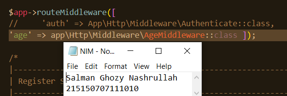

# Pemrograman-Integratif-A-Bab-5_215150707111010_Salman-Ghozy-Nashrullah

<h1>Basic Routing dan Migration</h1>
<h2>Langkah Percobaan</h2>
<h2>1. Dynamic Route</h2>

 <i>Dynamic route</i> adalah <i>route</i> yang dapat berubah-ubah, contohnya pada saat kita membuka
suatu halaman web, kadang kita melihat <i>/users/1 atau /users/2</i> , hal ini yang dinamakan
<i>dynamic routes</i>.
Untuk menambahkan <i>dynamic routes</i> pada aplikasi lumen kita, kita dapat menggunakan
<i>syntax</i> berikut, 

Saat menambahkan parameter pada <i>routes</i>, kita tidak terbatas pada 1 variabel saja, namun
kita dapat menambahkan sebanyak yang diperlukan seperti kode berikut,

 

Pada <i>dynamic routes</i> kita juga bisa menambahkan <i>optional routes</i>, yang mana <i>optional
routes</i> tidak mengharuskan kita untuk memberi variabel pada <i>endpoint</i> kita, namun saat kita
memanggil <i>endpoint</i>, dapat menggunakan parameter variabel ataupun tidak, seperti pada
kode dibawah ini,

<h3>2. Aliases Route</h3>

<i>Aliases Route</i> digunakan untuk memberi nama pada route yang telah kita buat, hal ini dapat
membantu kita, saat kita ingin memanggil <i>route</i> tersebut pada aplikasi kita. Berikut <i>syntax</i>
untuk menambahkan aliases route

<h3>3. Group Route</h3>

Pada <i>lumen</i>, kita juga dapat memberikan <i>grouping</i> pada <i>routes</i> kita agar lebih mudah pada
saat penulisan route pada <i>web.php</i> kita. Kita dapat melakukan <i>grouping</i> dengan
menggunakan <i>syntax berikut</i>,

Selain dapat mengelompokkan prefix, kita juga dapat mengelompokkan middleware dan
namespace pada kelompok routes kita.

<h3>4. Middleware</h3>

<i>Middleware</i> adalah penengah antara komunikasi aplikasi dan <i>client. Middleware</i> biasanya
digunakan untuk membatasi siapa yang dapat berinteraksi dengan aplikasi kita dan
semacamnya, kita dapat menambahkan <i>middleware</i> dengan menambahkan file pada <i>folder
app/Http/Middleware</i> . Pada folder tersebut terdapat <i>file ExampleMiddleware</i> , kita dapat men-
<i>copy file</i> tersebut untuk membuat <i>middleware</i> baru.
Pada praktikum kali ini akan dibuat middleware Age dengan isi,

Kemudian, setelah menambahkan <i>filter</i> pada <i>AgeMiddleware</i> , kita harus mendaftarkan
<i>AgeMiddleware</i> pada aplikasi kita, pada <i>file bootstrap/app.php</i> seperti berikut ini,

Pada baris 65 terdapat <i>comment</i> mengenai proses mendaftarkan suatu <i>middleware</i> dalam
aplikasi kita. Untuk menambahkan <i>middleware</i> pada aplikasi kita, kita dapat men-
<i>uncomment</i> baris 75 hingga 77, kemudian menambahkan <i>age middleware</i> ke dalamnya.

Namun, karena kita hanya ingin menambahkan <i>middleware</i> pada <i>route</i> tertentu, kita akan
menghapus <i>comment</i> pada baris 79 hingga 81, kemudian menambahkan <i>middleware age</i> di
dalamnya.
Lalu, kita dapat menambahkan <i>middleware</i> pada <i>routes</i> kita dengan menambahkan opsi
<i>middleware</i> pada salah satu <i>route</i>, contohnya,

